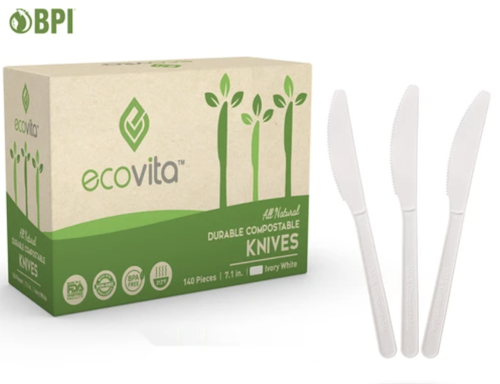

```{r setup, echo=FALSE, message=FALSE, warning=FALSE}
# Load libraries and settings here
library(tidyverse)
library(here)
knitr::opts_chunk$set(
  warning = FALSE,
  message = FALSE,
  comment = "#>",
  fig.path = "figs/", # Folder where rendered plots are saved
  fig.width = 7.252, # Default plot width
  fig.height = 4, # Default plot height
  fig.retina = 3 # For better plot resolution
)
```


# Abstract

This proposal outlines a market analysis to be conducted on disposable cutlery. The proposed product is a cutlery made from Omao, a home-compostable plastic that degrades in 90 days. Preliminary analysis shows that the disposable cutlery market was worth $33.9 million 2018, with only 33% being traditional plastic. Product attributes will cover price, style-choice, quantity, temperature extremes, and time to degrade. Decision variables with cover price, aethetic desgin, and packaging options.

 

 

# Introduction

With growing concerns regarding the impact of use of plastics on the environment, the global shift towards use of biodegradable products has increased exponentially in the last decade. Over 380 million tons of plastic are produced worldwide every year, and some reports indicate that up to 50% of that is for single-use purposes.^[1](https://plasticoceans.org/the-facts/#:~:text=We%20are%20producing%20over%20380,at%20least%20several%20hundred%20years)^ Single-use plastics are products that are made from petrochemicals and are meant to be disposed of right after use—often, within minutes. Some of the commonly used single-use plastics include bottles, wrappers, straws, cutlery and bags. Among these, the plastic cutleries have been wreaking havoc in recent times. A report on Marine waste on European beaches indicated that plastic cutlery takes up about 4.24% of total plastics disposed of.^[2](https://static.dw.com/image/46018210_7.png)^

>
>_**“Six million tons of non-durable plastics like spoons, forks and knives are discarded every year.”**_
[--- OneGreenPlanet](https://www.onegreenplanet.org/environment/how-you-can-stop-single-use-plastic-waste/){style="float:right"} \
 


The recent global health crisis drove the disposable plastics market to its peak. As restaurants across the United States shifted to takeout services to continue functioning during the pandemic, disposable packaging became the only option due to health concerns. The use of single use cutlery ballooned in the last two years and is still continuing due to concerns regarding hygiene among users. Even though we have almost reached the end of this pandemic, most restaurants still serve customers with plastic-sealed paper napkins and plastic utensils, takeout boxes and compostable cups to abide by the CDC guidelines. Due to their small size, light weight and contamination single use cutlery often end up in landfills or worse as litter.

Due to the harmful effects of single use plastics on the environment, several countries are introducing new regulations and have announced plans to ban such products in the near future. 

>
>_**“The government has announced plans to ban single-use plastic cutlery, plates and polystyrene cups in England as part of what it calls a 'war on plastic'.”**_
[--- BBC news](https://www.bbc.com/news/uk-politics-58360064){style="float:right"} \


Among the several sectors that use plastics, the Food Industry will take the biggest hit due to such regulations. 
As a solution to this problem and to ease the shift towards an eco-friendly lifestyle we propose the use of the newly introduced Omao material for the making of cutlery. The use of Omao’s biodegradable material could bridge the gap between the existing biodegradable cutleries and plastic cutleries.

<center>

</center>

 

 

# Market Opportunity

## Potential Customers

Our target customers will be any individual who wants to use separately packaged single-use cutlery sets at homes, school or at work places.
Although the customer size is huge, for our surveys, we will be reaching out to students, faculty members and employees.

## Competitors

There are some other commercial brands providing similar products for the same purpose, however, those products are made of different materials and introduced to the market with varying prices. Here we present four main types of cutlery based on their materials which could be seen as the apparent competitors in the market, and we pick representative products made of those materials to implement the analysis.

<center>

</center>

As we can conclude from the information list above:

1. For products made of plastic, its competitive advantage is the price. Even though the raw material is not environmentally friendly, it could provide a huge amount of products with a significantly lower price.

2. For products made of other eco-friendly materials (such as wood or paper), their competitive advantage is the packaging design and decoration, which would impact customers' purchase decisions.

3. Thus, for Omao cutlery, we have to pay attention to the package style with appropriate price to attract customers.

## Market Size

The market for single use cutlery is expected to grow at a rate of _7.65%_ for the forecast period of 2021 to 2028. Increase in the demand for disposable cutlery with the recent pandemic due to health and hygiene concerns is an essential factor driving this polymers market.

> _**“Disposable Cutlery Market to Gain a Massive Growth US$2,696.4 million by 2028”**_
[--- Reported by Global news wire](https://www.globenewswire.com/en/news-release/2019/01/10/1686139/34408/en/Disposable-Cutlery-Market-to-Gain-a-Massive-Growth-US-2-696-4-Mn-by-2028-Future-Market-Insights.html){style="float:right"} \


To precisely predict the market size based on the product type, we have to have a look at historical data for reference.
The market size data below came from the report **"Biodegradable Cutlery Market Analysis Report By Raw Material, By Region And Segment Forecasts From 2019 To 2025"**.^[3](https://www.millioninsights.com/industry-reports/global-biodegradable-cutlery-market)^

```{r marketSize, echo=FALSE, fig.height=4, fig.width=8}

Market <- read_csv(here::here('Data','marketsize.csv'))

Market %>%
  ggplot()+
  geom_point(aes(x = Year, y = Size, color = Material))+
  geom_line(aes(x = Year, y = Size, color = Material)) +
   labs(
      x = 'Year',
      y = 'Annual Market Size (USD Million)',
      title = 'U.S. Cutlery Market Size, by Material, 2015-2022')

Market_2019 <- Market %>%
  filter(Year == 2019) %>%
  mutate(Ratio = round(Size / sum(Size), 2) * 100)
```
```{r marketSize2019, echo=FALSE, fig.height=3.5, fig.width=5}

ggplot(Market_2019, aes(x = Material, y = Ratio, fill = Material)) +
  geom_col(color = "black") +
  geom_text(aes(label = paste(Ratio, "%")), position = position_stack(vjust = 0.5)) +
  labs(
      x = '',
      y = '',
      title = 'Ratio of Market Size for each Raw Material in 2019') +
  theme(legend.position = "none")
```

From the statistics analysis, we can obtain the following conclusions:

1. The market demand for cutlery made of plastic, wood,and paper is experiencing a stable increase year by year.

2. The cutlery products made of plastic takes the biggest ratio of the market size, the ratio is around 33% for every year.

3. However,the total ratio of "green material" is greater than plastic products. To define the "green material", we would include products from wood, paper, and other biodegradable materials. Green materials ratio can take up to 60% of the whole market.

4. Based on the historical data and prediction, we could define that the market size for Omao products will be around USD 1.56 ~ 2.0 million for the U.S., which captures around 20%-26% of the whole market.

Other similar reports suggest that “the global biodegradable cutlery market size accounted for _USD 33.9 million_, in 2018 and is projected to grow at a significant rate of CAGR 5.9% during the forecast period, 2019 to 2025."

Regional-level insights from the first report indicates the market for biodegradable cutlery in Europe has the greatest scope, accounting for 36.3% of the overall revenue in 2018.^[4](https://www.millioninsights.com/industry-reports/global-biodegradable-cutlery-market)^

<center>

</center>

 

 

# Product Attributes & Decision Variables

## Product Attributes

In the analysis for this product, the key elements we intend to gauge customer interest in are Price, Color or Style of cutlery, Quantity of cutlery in each unit of purchase, Durability of the product, ability to use product with Hot foods and Cold foods, the Time it takes for the product to compost and the Time the product can sit on the shelf.

Price is of course a key variable that influences whether a customer might choose to buy a product, and how much profit the company might make from it. Color as well can be highly influential on whether a customer chooses to buy a certain product; while we cannot directly assess commercial businesses as customers, they are still a market we hope our product might one day penetrate, so we have decided to limit our offerings in the color category to Black and White. Style is similarly important, and we plan to test how customers value simple, detailed, and ornate styles.

Disposable cutlery is generally sold in boxes, but the quantity inside the box can vary widely, and can influence what brand a customer chooses to go with. We plan to test quantities of 20 per box, 50 per box, 100 per box, and 200 per box.

Durability is highly associated with customer satisfaction and repeat purchases. A plastic fork breaks while vigorously eating a burrito bowl is not satisfying. Similarly, being able to use a disposable spoon to eat ice cream or stir your coffee might affect a customer’s decision to purchase the product. We propose to test customer sensitivity to these factors by simulating customer reviews.

The choice of Omao as the material for this plastic nearly requires us to be environmentally conscious. Important factors in the impact of disposable cutlery on the environment is how long they will survive in a landfill. The market in environmentally friendly cutlery also has great variability in how long a product can survive on the shelf. The customer might not actually have a huge opinion about this, but we propose to show sample specs where some products disclaim this information, and then later show sample specs where all values are filled out.

## Decision Variables

Decision variables are the key elements the company must make decisions on when designing the product. After analyzing the potential competitors and the disposable cutlery market, we categorized these essential variables as **Price**, **Design**, **Package Material**, **Package Quantity**, and **Package Setting**. Each variable will be discussed in more detail below.

### Price 
In this discussion, we assume that the three cutlery pieces, spoon, fork, and knife, each have the same price. For visualization purposes, we will calculate all the prices into **100 pieces per package** and show the cost per count in brackets at the end of the price tag. Amazon makes good use of this style, as seen below.

<center>

</center>


### Design
Design, in our definition, is what the product may look like and all the structural features that may affect other attributes. For example, the different thicknesses of the cutlery may lead to changes in the durability and quality of the product. We have categorized the look of the design into two types: fancy and general-use.

Design has three key features:

  - Material
  - Size
  - Color
  
The material has already been set as Omao, but the market analysis will consider competitor materials as well. Due to the product features, color shall be considered a sub-variable of design and is brought up mostly for the sake of discussion. The most common colors of disposable cutlery are white, black, and transparent. What colors Omao would realistically be able to offer is currently unknown.  

<center>



</center>
 

### Package
Disposable cutlery is a product that doesn't require a complicated design. We believe that the Package is one of the most critical decision variables of the producer because there are so many variables in package design. We have categorized package variables into Material, Setting, and Quantity, and the explanation of each variable is in the following section.

#### Package - Material
We define the Material as a sub-category in the Package as the outlook and size of the wrap-up. The unit of the Material is **type/size**. For size calculation, We would turn the wrap-up from 3-Dimension into 2-Dimension and adopt the unit of **cm^2**. Besides the material and size, the producer can get creative on presenting the package outlook to branding the uniqueness of the product.

#### Package - Setting
The Setting sub-category in packaging is how the cutlery is packed in the unit of purchase. For example, there may be only one kind of cutlery in each unit; a package may include three kinds of cutlery, either wrapped together **in one packet** or **packed in bulk**. Another Setting option commonly seen is a cutlery packet with a napkin, as well as salt & pepper; we would call this kind of wrap-up the **Combo Setting** in this analysis. Setting will have two units, the type of setting and count the count of pieces; these two units together will define the exact configuration we are analyzing.

#### Package - Quantity
The Quantity sub-category in the Package is how many units of the products are in each unit of purchase (pack). For example, a pack may include 100 units of three kinds of cutlery in one unit. In another case, three kinds of cutlery sold in bulk might be 100/100/120 for spoon/knife/fork, respectively. The unit of the Quantity we have adopted is **count/pack**.

 

 

# Questions

1. Europe is instigating a ban on "disposable plastic cutlery". Researching this law and whether it would ban Omao-made cutlery is a big question. Since Omao degrades in 90 days, it might be that the ban would not apply to them. If so, there will be a very good market opportunity in Europe soon.

2. What color is Omao? What colors can Omao be made in?

3. Can Omao be used in piping hot coffee? Can omao be used in ice cream?

4. How much does Omao cost? How much does producing the raw material cost per gram/kg?


